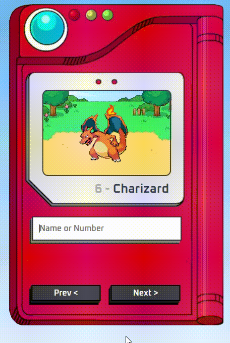

# 📖 Pokédex

## 📌 Sobre o Projeto
Uma **Pokédex interativa** desenvolvida com **HTML, CSS e JavaScript**, que permite pesquisar Pokémon e visualizar suas informações, como nome, tipo e imagem oficial.  
Inspirada no universo Pokémon.

---

## 🚀 Funcionalidades
- 🔍 Buscar Pokémon pelo nome ou número.
- 🖼 Exibir sprite oficial do Pokémon.
- 📜 Mostrar tipo(s) e número na Pokédex.
- 📱 Interface responsiva.

---

## 🛠 Tecnologias Utilizadas
- **HTML5**
- **CSS3**
- **JavaScript (Vanilla)**
- **[PokéAPI](https://pokeapi.co/)** (para buscar os dados)

---

## 📷 Demonstração


---

## 📂 Como Usar
1.Acesse o link: https://vinicius-ferrarini.github.io/Pokedex

2. Clone o repositório:
   ```bash
   git clone https://github.com/Vinicius-Ferrarini/Pokedex
